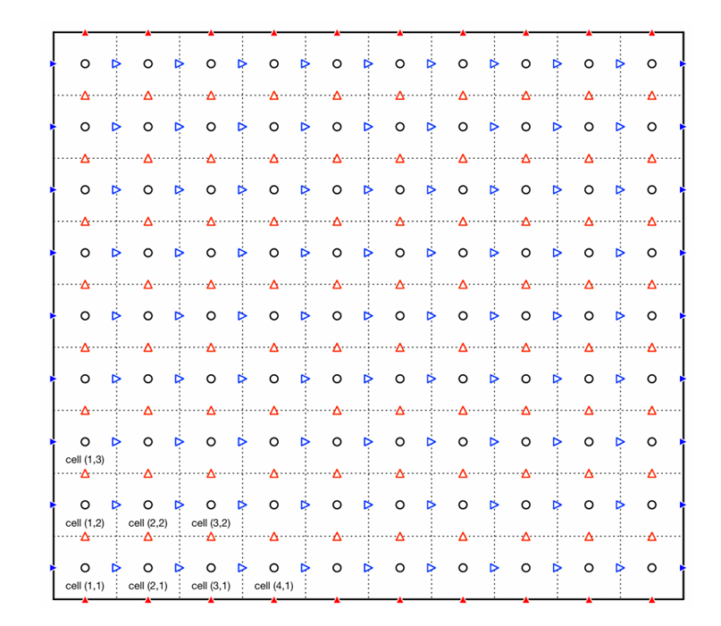

## **Objectives**
1. **Develop an incompressible Navier-Stokes solver** using a fractional-step method and finite difference discretization to simulate viscous fluid flows.  
2. **Validate the solver** by simulating lid-driven cavity flow and comparing velocity profiles with benchmark data to assess accuracy.  
3. **Apply the solver to simulate flow over a square obstacle** at different Reynolds numbers to analyze wake formation, vortex shedding, and flow separation.  
4. **Evaluate the solver’s performance and numerical stability** by testing different boundary conditions, time-stepping methods, and solver configurations.  

---

## **Governing Equations**  
The incompressible Navier-Stokes (iNS) equations governing viscous, incompressible fluid flow are given as:  

$$
\frac{\partial \mathbf{u}}{\partial t} + (\mathbf{u} \cdot \nabla) \mathbf{u} = -\frac{1}{\rho} \nabla p + \nu \nabla^2 \mathbf{u} + \mathbf{f}, \quad \nabla \cdot \mathbf{u} = 0
$$

where $ \mathbf{u} $ is the velocity field, $ p $ is pressure, $ \nu $ is kinematic viscosity, and $ \mathbf{f} $ represents external forces. To solve these equations, a **fractional-step method** is used with the **Adams-Bashforth (AB2) scheme for advection** and **Crank-Nicolson (CN) scheme for diffusion**.

The final discretized iNS equations, formulated by **Perot**, ensure second-order accuracy in time and are expressed as:

$$
R u^F = S u^n + \Delta t \left( \frac{3a^n - a^{n-1}}{2} \right) + \frac{\Delta t \nu}{2} \left( bc_L^{n+1} + bc_L^n \right)
$$

$$
D R^{-1} G P^{n+1} = \frac{D u^F}{\Delta t} + \frac{bc_D^{n+1}}{\Delta t}
$$

$$
u^{n+1} = u^F - \Delta t R^{-1} G P^{n+1}
$$

where $ u^F $ is the fractional-step velocity, $ a^n $ is the advection term, and $ bc_L, bc_D $ are boundary condition terms. The operators are defined as:

$$
R = I - \frac{\Delta t}{2} \nu L, \quad S = I + \frac{\Delta t}{2} \nu L, \quad R^{-1} \approx I + \frac{\Delta t}{2} \nu L
$$

where $ D, G, L $ represent the divergence, gradient, and Laplacian operators, respectively.

---

## **Grid and Domain Setup**  
A **staggered grid** is used to discretize the domain, where velocity components $ u, v $ are stored at the **cell faces**, while **pressure is stored at the cell centers**. This approach helps prevent **checkerboard instability**, which occurs when using a regular grid for pressure and velocity storage.

The computational domain is a **$ 1 \times 1 $ square** discretized into a **$ 129 \times 129 $ grid**. The boundary conditions are as follows:
- **Top boundary:** $ u = 1 $, $ v = 0 $ (to simulate a moving lid).  
- **Bottom, left, and right boundaries:** $ u = 0 $, $ v = 0 $ (stationary walls).  
- **Initial conditions:** The velocity and pressure fields are initialized to zero.

A schematic representation of the staggered grid is shown below:

---

## **Solution Procedure**  
The solution begins with the creation of a **pointer matrix system**, which maps 2D velocity and pressure locations to a **1D index** for efficient data handling. This matrix is used to construct key operators, including **divergence, Laplacian, gradient, advection, and boundary condition vectors**.  

The simulation starts with **zero initial conditions** for velocity and pressure. The **fractional-step algorithm** is executed iteratively, with each time step consisting of:  
1. **Velocity prediction step** using a **conjugate gradient solver**.  
2. **Pressure correction step** to enforce incompressibility.  
3. **Velocity update step** via matrix operations.  

A **small time step** is chosen to maintain numerical stability. The solver is validated against **Ghia et al.’s benchmark results** at **Re = 100**, with a **conjugate gradient solver tolerance of $10^{-10}$** to ensure accuracy in solving the linear systems.  

---

## **Results and Discussion**  

The streamline plot at **Re = 100** shows a **dominant clockwise vortex** in the cavity center, with **secondary vortices** near the bottom corners due to flow separation. These patterns align exactly with **Ghia et al.’s benchmark results**, confirming solver accuracy. Similar trends appear in the **velocity magnitude contours**.  

The **vorticity contours** reveal strong **shear forces near the top boundary** due to lid motion, with values ranging from **-4 to +6**. The contours and values **match exactly with Ghia et al.**, demonstrating the solver’s ability to accurately capture vorticity transport.  

Validation against **Ghia et al.’s velocity profiles** shows minor deviations at **5 time units**, particularly in steep gradient regions, but by **10 time units**, the numerical solution **fully converges** to the benchmark data, confirming solver reliability.  

  
  
  
  
